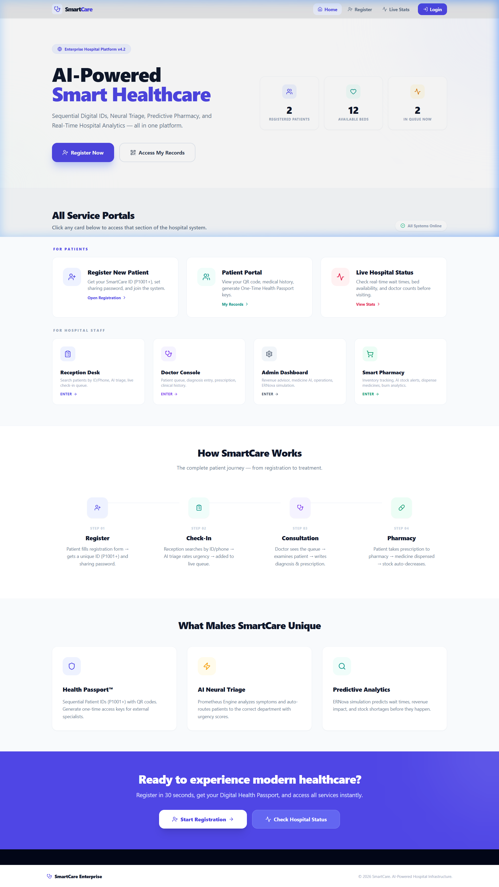
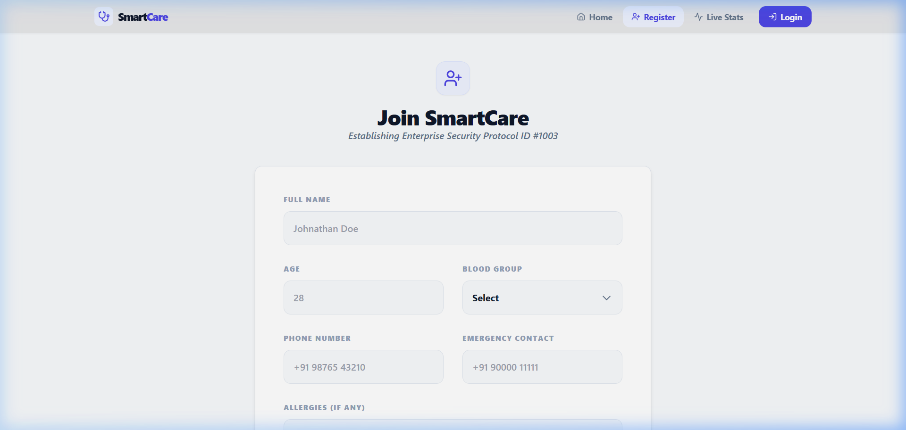
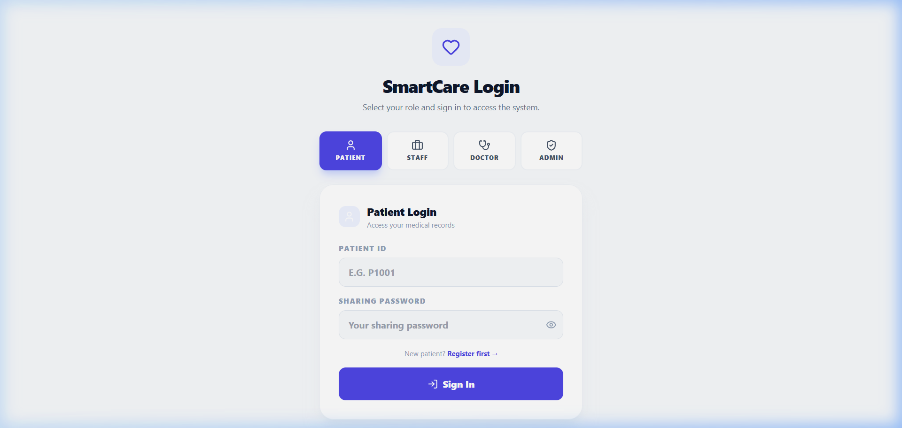
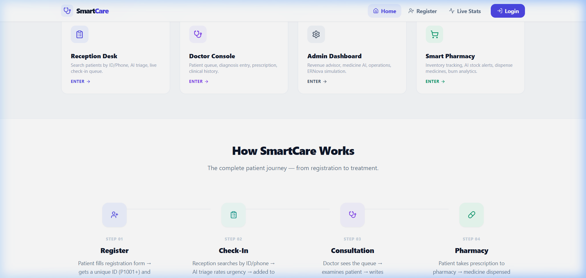

<p align="center">
  
  
  
  
  
</p>

<h1 align="center">🏥 SmartCare</h1>
<h3 align="center"><em>AI-Powered Hospital Management System — The Future of Healthcare Administration</em></h3>

<p align="center">
  <strong>One platform. Every hospital operation. Zero paper.</strong><br/><br/>
  From patient registration to AI triage, live doctor queues, predictive pharmacy,<br/>
  and admin analytics — SmartCare digitizes the entire hospital workflow<br/>
  in a single, real-time application.
</p>

<br/>

<p align="center">
  <a href="https://smartcare-one.vercel.app">Live demo Smartcare Project</a>
</p>

<p align="center">
  <em>👆 Click the button above to experience SmartCare live — no installation needed!</em>
</p>

> **Test Credentials:**
>
> | Role        | Login                                  | Password                       |
> | ----------- | -------------------------------------- | ------------------------------ |
> | **Patient** | `P1001`                                | _(set during registration)_    |
> | **Staff**   | Register via Login → Staff → Register  | _(you choose on registration)_ |
> | **Doctor**  | Register via Login → Doctor → Register | _(you choose on registration)_ |
> | **Admin**   | Register via Login → Admin → Register  | _(you choose on registration)_ |

---

## 📸 See It In Action

<p align="center">
  
  <br/>
  <em>🏠 The SmartCare landing page — Live stats, all service portals, and the complete patient journey at a glance.</em>
</p>

<br/>

<p align="center">
  
  <br/>
  <em>📝 Patient Registration — Sequential digital IDs (P1001+), sharing passwords, and instant setup in 30 seconds.</em>
</p>

<br/>

<p align="center">
  
  <br/>
  <em>🔐 Unified Login — One login page for Patient, Staff, Doctor, and Admin with role-based access control.</em>
</p>

<br/>

<p align="center">
  
  <br/>
  <em>⚡ What Makes SmartCare Unique — Health Passport™, AI Neural Triage, and Predictive Analytics.</em>
</p>

---

## 💡 The Problem We Solve

Modern hospitals still run on **fragmented, outdated systems**:

- 📋 **Paper-based records** — Lost files, illegible handwriting, no searchability
- 🔀 **Disconnected departments** — Registration, triage, consultation, pharmacy, billing all in separate silos
- ⏳ **No real-time visibility** — Patients wait hours without knowing queue position; admins have no live KPIs
- 💊 **Manual pharmacy tracking** — Stock-outs go undetected until it's too late
- 🚫 **No emergency access** — Critical patient data isn't accessible when it matters most

### **SmartCare fixes ALL of this with ONE application.**

> _"In a world where you can order food in 5 taps, why should hospital administration take 50 forms?"_

---

## ✨ Key Features

### 🎫 Health Passport™ — Digital Patient Identity

- **Sequential IDs** (P1001, P1002…) — human-readable, no UUIDs
- **QR Code** auto-generated for every patient — scannable emergency access
- **OTP Sharing** — generate timed 6-digit access codes (5/10/15/30 min) to share medical records verbally
- **Sharing Password** — patients control who sees their full medical history

### 🧠 AI Neural Triage — Prometheus Engine

- Receptionist enters symptoms → AI classifies priority (**LOW / HIGH / CRITICAL**)
- Auto-routes to the correct department (General Medicine, Internal Medicine, Cardiology/Emergency)
- Patient is added to a **live, real-time queue** that doctors see instantly

### 👨‍⚕️ Doctor Clinical Decision Suite

- **Color-coded priority queue** — 🟢 Green for general, 🔴 Red for critical
- Full **clinical timeline** of patient's medical history
- **Smart Prescription Builder** — dropdown from live pharmacy inventory with quantity selection
- On finalize: record saved → patient removed from queue → **pharmacy stock auto-decreased**

### 💊 Predictive Smart Pharmacy

- **AI Stock Advisor** — predicts days until stock-out based on daily burn rate
- **Real-time sync** — doctor prescriptions auto-deduct from inventory
- **Batch Restock** — one-click bulk reorder for all low-stock medicines
- Add, dispense, delete medicines with live dashboard

### 📊 Admin Command Center

- **4 Tabs:** Operations Analytics · Revenue Advisor · Medicine AI · Predictive ROI
- **Live KPIs:** Patient load, bed utilization, revenue trends, AI system health
- **Revenue Report Export** — download billing data as CSV
- **ERNova Simulation Engine** — predict patient surges, resource bottlenecks, and revenue impact before they happen

### 🚨 Emergency Profile System

- **Two-Tier Access:** Public vitals (blood group, allergies, emergency contact) are ALWAYS visible — no password needed
- Full medical records require **password or OTP** — privacy-preserving by design
- **Designed to save lives** — critical info is scannable even when the patient is unconscious

### 🔐 Role-Based Access Control (RBAC)

| Role        | Access                               |
| ----------- | ------------------------------------ |
| **Patient** | Patient Portal, Registration, Stats  |
| **Staff**   | Reception, Pharmacy                  |
| **Doctor**  | Doctor Console                       |
| **Admin**   | **Everything** — full system control |

---

## 🏗️ Architecture

```
SmartCare/
├── src/
│   ├── App.jsx                     # Routing + RBAC + Protected Routes
│   ├── context/AuthContext.jsx     # Global auth state (React Context + localStorage)
│   ├── utils/supabaseClient.js    # Supabase connection
│   ├── pages/
│   │   ├── Home.jsx                # Landing page with live stats
│   │   ├── Registration.jsx        # Patient registration (sequential IDs)
│   │   ├── LoginPage.jsx           # Unified login (4 roles)
│   │   ├── PatientPortal.jsx       # QR codes, OTP sharing, medical history
│   │   ├── ReceptionDashboard.jsx  # Patient lookup + AI triage + check-in
│   │   ├── DoctorDashboard.jsx     # Queue + diagnosis + prescription builder
│   │   ├── PharmacyPortal.jsx      # Inventory + dispense + AI advisories
│   │   ├── AdminDashboard.jsx      # Analytics + revenue + simulation
│   │   ├── EmergencyProfile.jsx    # Public vitals + locked records
│   │   └── PublicStats.jsx         # Public hospital statistics
│   ├── components/                 # Reusable UI components + chart widgets
│   └── simulation/                 # ERNova engine (patient generator, triage, allocation)
├── package.json
├── tailwind.config.js
└── vite.config.js
```

---

## 🔄 How Data Flows — The Complete Patient Journey

```
┌──────────────┐    ┌──────────────┐    ┌──────────────┐    ┌──────────────┐
│  1. REGISTER │───▶│ 2. CHECK-IN  │───▶│ 3. CONSULT   │───▶│ 4. PHARMACY  │
│              │    │              │    │              │    │              │
│ Patient fills│    │ Reception    │    │ Doctor picks │    │ Prescription │
│ form → gets  │    │ searches →   │    │ from queue → │    │ auto-deducts │
│ P1001 ID     │    │ AI Triage →  │    │ Diagnosis +  │    │ from stock   │
│              │    │ Added to     │    │ Prescription │    │              │
│              │    │ live queue   │    │ → Record     │    │ Manual       │
│              │    │              │    │   saved      │    │ dispense too │
└──────────────┘    └──────────────┘    └──────────────┘    └──────────────┘
                                                │
                                    ┌───────────┘
                                    ▼
                          ┌──────────────────┐
                          │  5. ADMIN SEES   │
                          │  EVERYTHING      │
                          │                  │
                          │ KPIs • Revenue   │
                          │ Inventory AI     │
                          │ ERNova Sim       │
                          └──────────────────┘
```

---

## 🛠️ Tech Stack

| Layer        | Technology                   | Why                                                  |
| ------------ | ---------------------------- | ---------------------------------------------------- |
| **Frontend** | React 19 + Vite 7            | Blazing-fast HMR, component architecture             |
| **Styling**  | Tailwind CSS 3               | Utility-first, consistent design system              |
| **Backend**  | Supabase (PostgreSQL)        | Instant REST API, real-time subscriptions, free tier |
| **Charts**   | Recharts                     | SVG-based, composable chart components               |
| **Icons**    | Lucide React                 | 1400+ modern icons, tree-shakeable                   |
| **QR Codes** | qrcode.react                 | Client-side QR generation                            |
| **Routing**  | React Router v7              | Client-side SPA navigation                           |
| **State**    | React Context + localStorage | Lightweight, no Redux overhead                       |

---

## 🚀 Getting Started

### Prerequisites

- **Node.js** v18+ and **npm** v9+
- A **Supabase** project (free tier works)

### Installation

```bash
# 1. Clone the repository
git clone https://github.com/girish50/SmartCare.git
cd SmartCare

# 2. Install dependencies
npm install

# 3. Set up environment variables
# Create a .env file with your Supabase credentials:
# VITE_SUPABASE_URL=your_supabase_url
# VITE_SUPABASE_ANON_KEY=your_anon_key

# 4. Start the development server
npm run dev
```

The app will be running at **http://localhost:5173** 🎉

### Database Setup

Create the following tables in your Supabase dashboard:

| Table             | Key Columns                                                                                                                     |
| ----------------- | ------------------------------------------------------------------------------------------------------------------------------- |
| `patients`        | `id`, `patient_id`, `full_name`, `age`, `blood_group`, `phone`, `emergency_contact`, `address`, `allergies`, `sharing_password` |
| `queue`           | `id`, `patient_id`, `patient_name`, `symptoms`, `priority`, `status`, `created_at`                                              |
| `medical_records` | `id`, `patient_id`, `diagnosis`, `prescription`, `created_at`                                                                   |
| `inventory`       | `id`, `medicine_name`, `stock_count`, `daily_burn_rate`, `reorder_level`                                                        |
| `beds`            | `id`, `total_capacity`, `occupied_count`                                                                                        |
| `billing`         | `id`, `amount`, `service_type`, `status`, `created_at`                                                                          |
| `staff_users`     | `id`, `name`, `email`, `password`                                                                                               |
| `doctor_users`    | `id`, `name`, `email`, `password`, `specialization`                                                                             |
| `admin_users`     | `id`, `name`, `email`, `password`                                                                                               |

---

## 🌟 What Makes SmartCare Stand Out

| Feature              | Traditional Systems     | SmartCare                                     |
| -------------------- | ----------------------- | --------------------------------------------- |
| Patient Registration | Paper forms, 15 min     | Digital, 30 seconds, sequential ID            |
| Triage               | Manual nurse assessment | AI-powered priority classification            |
| Doctor Queue         | Call by name / token    | Real-time color-coded live queue              |
| Prescription         | Handwritten on paper    | Digital, auto-linked to pharmacy inventory    |
| Pharmacy Stock       | Manual counting         | Predictive analytics with burn-rate AI        |
| Medical Records      | Paper files in cabinets | Cloud-based, QR-scannable, password-protected |
| Emergency Access     | No standard protocol    | 2-tier: public vitals + locked full history   |
| Admin Analytics      | Manual Excel reports    | Real-time KPIs + ERNova simulation engine     |

---

## 📄 Research & Academic Relevance

SmartCare addresses critical challenges identified in healthcare administration research:

- **WHO Digital Health Strategy (2020-2025):** Advocates for integrated digital solutions that improve efficiency and patient outcomes
- **Hospital Information System (HIS) modernization:** SmartCare demonstrates how a single-page application can replace 5+ separate legacy systems
- **AI in Clinical Decision Support:** The Prometheus triage engine showcases practical AI integration at the point of care
- **Patient Data Sovereignty:** The two-tier emergency access model balances life-saving data accessibility with privacy (HIPAA, GDPR considerations)
- **Predictive Supply Chain:** ERNova demonstrates how predictive analytics can prevent pharmaceutical stock-outs

> _SmartCare serves as a comprehensive proof-of-concept that all hospital administration — from patient intake to discharge analytics — can be unified into a single, AI-enhanced, real-time web application._

---

## 🗺️ Roadmap

- [x] Deploy to Vercel with live demo link ✅
- [ ] Add Supabase Auth SDK for production-grade authentication
- [ ] Integrate real SMS/Email OTP via Twilio/SendGrid
- [ ] Add bed management visual floor map
- [ ] Multi-hospital support with cross-facility patient transfer
- [ ] Mobile PWA for patient self-service
- [ ] AI-powered drug interaction checker in prescription builder
- [ ] FHIR/HL7 interoperability layer for integration with existing hospital systems

---

## 👤 Author

**P Girish Varma**

- GitHub: [@girish50](https://github.com/girish50)

---

## 📜 License

This project is licensed under the **MIT License** — see the [LICENSE](LICENSE) file for details.

---

<p align="center">
  <strong>⭐ If SmartCare impressed you, consider giving it a star! ⭐</strong>
  <br/><br/>
  <em>Built with ❤️ by P Girish Varma</em>
  <br/>
  <sub>Making healthcare smarter, one commit at a time.</sub>
</p>
